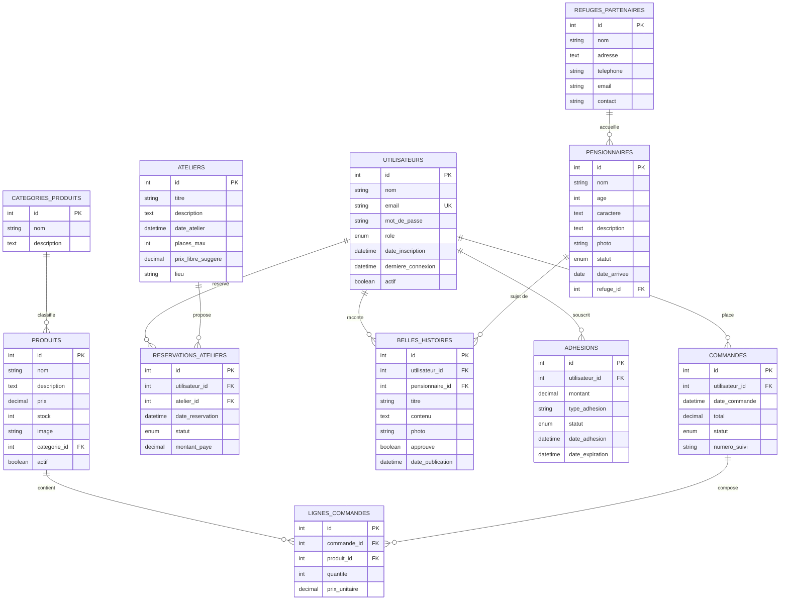

# 📊 MCD - Modèle Conceptuel de Données
## Le Repaire des Moustaches

**Date** : 25 mai 2026  
**Version** : 2.0 (Optimisée)

---

## 📐 Diagramme Entité-Relation

---

## 📋 Description des Entités

### 🧑 UTILISATEURS
**Description** : Gère tous les utilisateurs (clients, admins, bénévoles)  
**Clé primaire** : `id`

| Attribut | Type | Contrainte | Description |
|----------|------|-----------|-------------|
| id | INT | PK, AUTO_INCREMENT | Identifiant unique |
| nom | VARCHAR(100) | NOT NULL | Nom complet |
| email | VARCHAR(255) | UNIQUE, NOT NULL | Adresse email unique |
| mot_de_passe | VARCHAR(255) | NOT NULL | Hash du mot de passe (bcrypt) |
| role | ENUM | DEFAULT 'client' | client, admin, benevole |
| date_inscription | DATETIME | DEFAULT CURRENT | Date d'inscription |
| derniere_connexion | DATETIME | NULL | Dernière visite |
| actif | BOOLEAN | DEFAULT TRUE | Compte actif ou inactif |

---

### 🏠 REFUGES_PARTENAIRES
**Description** : Les refuges partenaires qui accueillent les chats  
**Clé primaire** : `id`

| Attribut | Type | Contrainte | Description |
|----------|------|-----------|-------------|
| id | INT | PK, AUTO_INCREMENT | Identifiant unique |
| nom | VARCHAR(100) | NOT NULL | Nom du refuge |
| adresse | TEXT | NOT NULL | Adresse complète |
| contact | VARCHAR(100) | NULL | Personne de contact |
| telephone | VARCHAR(20) | NULL | Téléphone |
| email | VARCHAR(255) | NULL | Email du refuge |

---

### 🐱 PENSIONNAIRES
**Description** : Les chats en attente d'adoption  
**Clé primaire** : `id`  
**Clé étrangère** : `refuge_id` → REFUGES_PARTENAIRES

| Attribut | Type | Contrainte | Description |
|----------|------|-----------|-------------|
| id | INT | PK, AUTO_INCREMENT | Identifiant unique |
| nom | VARCHAR(50) | NOT NULL | Nom du chat |
| age | INT | NULL | Âge en mois/ans |
| caractere | TEXT | NULL | Caractéristiques (joueur, calme...) |
| description | TEXT | NULL | Description détaillée |
| photo | VARCHAR(255) | NULL | URL de la photo |
| statut | ENUM | DEFAULT 'a_adopter' | a_adopter, adopte, en_famille, decede |
| date_arrivee | DATE | NOT NULL | Date d'arrivée au refuge |
| refuge_id | INT | FK, NOT NULL | Refuge d'accueil |

---

### 🎓 ATELIERS
**Description** : Les ateliers organisés par le Repaire  
**Clé primaire** : `id`

| Attribut | Type | Contrainte | Description |
|----------|------|-----------|-------------|
| id | INT | PK, AUTO_INCREMENT | Identifiant unique |
| titre | VARCHAR(100) | NOT NULL | Titre de l'atelier |
| description | TEXT | NULL | Descriptif détaillé |
| date_atelier | DATETIME | NOT NULL | Date et heure de l'atelier |
| places_max | INT | NOT NULL | Nombre de places disponibles |
| prix_libre_suggere | DECIMAL(10,2) | NULL | Prix suggéré (participation libre) |
| lieu | VARCHAR(255) | NULL | Lieu de l'atelier |

---

### 📅 RESERVATIONS_ATELIERS
**Description** : Les réservations pour les ateliers  
**Clé primaire** : `id`  
**Clés étrangères** : `utilisateur_id`, `atelier_id`

| Attribut | Type | Contrainte | Description |
|----------|------|-----------|-------------|
| id | INT | PK, AUTO_INCREMENT | Identifiant unique |
| utilisateur_id | INT | FK, NOT NULL | Utilisateur ayant réservé |
| atelier_id | INT | FK, NOT NULL | Atelier réservé |
| date_reservation | DATETIME | DEFAULT CURRENT | Date de la réservation |
| statut | ENUM | DEFAULT 'confirmee' | confirmee, annulee, presente, absente |
| montant_paye | DECIMAL(10,2) | NULL | Montant payé pour l'atelier |

**Note** : UNIQUE(utilisateur_id, atelier_id) pour éviter les doublons

---

### 🏷️ CATEGORIES_PRODUITS
**Description** : Catégories de produits de la boutique  
**Clé primaire** : `id`

| Attribut | Type | Contrainte | Description |
|----------|------|-----------|-------------|
| id | INT | PK, AUTO_INCREMENT | Identifiant unique |
| nom | VARCHAR(50) | NOT NULL | Nom de la catégorie |
| description | TEXT | NULL | Description |

---

### 📦 PRODUITS
**Description** : Les produits vendus en boutique  
**Clé primaire** : `id`  
**Clé étrangère** : `categorie_id` → CATEGORIES_PRODUITS

| Attribut | Type | Contrainte | Description |
|----------|------|-----------|-------------|
| id | INT | PK, AUTO_INCREMENT | Identifiant unique |
| nom | VARCHAR(100) | NOT NULL | Nom du produit |
| description | TEXT | NULL | Description détaillée |
| prix | DECIMAL(10,2) | NOT NULL | Prix unitaire |
| stock | INT | DEFAULT 0 | Quantité en stock |
| image | VARCHAR(255) | NULL | URL de l'image |
| categorie_id | INT | FK, NOT NULL | Catégorie du produit |
| actif | BOOLEAN | DEFAULT TRUE | Produit visible ou non |

---

### 🛒 COMMANDES
**Description** : Les commandes passées par les utilisateurs  
**Clé primaire** : `id`  
**Clé étrangère** : `utilisateur_id` → UTILISATEURS

| Attribut | Type | Contrainte | Description |
|----------|------|-----------|-------------|
| id | INT | PK, AUTO_INCREMENT | Identifiant unique |
| utilisateur_id | INT | FK, NOT NULL | Client ayant commandé |
| date_commande | DATETIME | DEFAULT CURRENT | Date de la commande |
| total | DECIMAL(10,2) | NULL | Total de la commande |
| statut | ENUM | DEFAULT 'panier' | panier, validee, payee, expediee, livree, annulee |
| numero_suivi | VARCHAR(50) | NULL | Numéro de suivi postal |

---

### 📝 LIGNES_COMMANDES
**Description** : Détail des articles dans chaque commande  
**Clé primaire** : `id`  
**Clés étrangères** : `commande_id`, `produit_id`

| Attribut | Type | Contrainte | Description |
|----------|------|-----------|-------------|
| id | INT | PK, AUTO_INCREMENT | Identifiant unique |
| commande_id | INT | FK, NOT NULL | Commande référencée |
| produit_id | INT | FK, NOT NULL | Produit commandé |
| quantite | INT | NOT NULL | Quantité commandée |
| prix_unitaire | DECIMAL(10,2) | NOT NULL | Prix au moment de la commande |

---

### 💳 ADHESIONS
**Description** : Les adhésions des utilisateurs au Repaire  
**Clé primaire** : `id`  
**Clé étrangère** : `utilisateur_id` → UTILISATEURS

| Attribut | Type | Contrainte | Description |
|----------|------|-----------|-------------|
| id | INT | PK, AUTO_INCREMENT | Identifiant unique |
| utilisateur_id | INT | FK, NOT NULL | Utilisateur adhérent |
| montant | DECIMAL(10,2) | NOT NULL | Montant de l'adhésion |
| type_adhesion | VARCHAR(50) | NOT NULL | Type (simple, étudiant, famille...) |
| statut | ENUM | DEFAULT 'active' | active, expiree, suspendue |
| date_adhesion | DATETIME | DEFAULT CURRENT | Date d'adhésion |
| date_expiration | DATETIME | NULL | Date d'expiration |

---

### 📖 BELLES_HISTOIRES
**Description** : Les témoignages et histoires de chats adoptés  
**Clé primaire** : `id`  
**Clés étrangères** : `utilisateur_id`, `pensionnaire_id`

| Attribut | Type | Contrainte | Description |
|----------|------|-----------|-------------|
| id | INT | PK, AUTO_INCREMENT | Identifiant unique |
| utilisateur_id | INT | FK, NOT NULL | Auteur de l'histoire |
| pensionnaire_id | INT | FK, NOT NULL | Chat concerné par l'histoire |
| titre | VARCHAR(100) | NOT NULL | Titre de l'histoire |
| contenu | TEXT | NOT NULL | Contenu du témoignage |
| photo | VARCHAR(255) | NULL | Photo additionnelle |
| approuve | BOOLEAN | DEFAULT FALSE | Modération avant publication |
| date_publication | DATETIME | NULL | Date de publication |

---

## 🔑 Associations et Cardinalités

| De | Vers | Cardinalité | Description |
|---|---|---|---|
| UTILISATEURS | COMMANDES | 1 → N | Un utilisateur peut avoir plusieurs commandes |
| UTILISATEURS | RESERVATIONS_ATELIERS | 1 → N | Un utilisateur peut réserver plusieurs ateliers |
| UTILISATEURS | BELLES_HISTOIRES | 1 → N | Un utilisateur peut écrire plusieurs histoires |
| UTILISATEURS | ADHESIONS | 1 → N | Un utilisateur peut avoir plusieurs adhésions |
| REFUGES_PARTENAIRES | PENSIONNAIRES | 1 → N | Un refuge accueille plusieurs chats |
| PENSIONNAIRES | BELLES_HISTOIRES | 1 → N | Un chat peut être sujet de plusieurs histoires |
| ATELIERS | RESERVATIONS_ATELIERS | 1 → N | Un atelier peut avoir plusieurs réservations |
| CATEGORIES_PRODUITS | PRODUITS | 1 → N | Une catégorie contient plusieurs produits |
| PRODUITS | LIGNES_COMMANDES | 1 → N | Un produit peut être dans plusieurs commandes |
| COMMANDES | LIGNES_COMMANDES | 1 → N | Une commande a plusieurs lignes |

---

## ✨ Améliorations par rapport à la version originale

### ✅ Changements apportés

1. **Fusion des utilisateurs** : Suppression de `admin_users`, utilisation du rôle dans `utilisateurs`
2. **Suppression de `places_disponibles`** : Calculée dynamiquement (places_max - count réservations)
3. **NOT NULL ajoutés** : Sur les clés étrangères et attributs critiques
4. **Timestamps** : `created_at` et `updated_at` sur toutes les tables
5. **Statuts enrichis** : Plus de transitions possibles (présence/absence aux ateliers)
6. **Soft delete optionnel** : Champ `actif` pour les utilisateurs et produits
7. **Audit trail** : Table `AUDIT_LOG` pour traçabilité
8. **Indexes** : Optimisation des performances sur les clés de recherche
9. **Contraintes relationnelles** : `ON DELETE CASCADE` ou `RESTRICT` appropriés
10. **Unicité** : Constraint `UNIQUE` sur email et doublon reservations

---

## 📊 Règles métier

### RM1 : Réservation d'atelier
- Un utilisateur **ne peut réserver qu'une fois** par atelier
- Le nombre de réservations ne peut pas dépasser `places_max`

### RM2 : Stock et commandes
- Une ligne de commande ne peut référencer qu'un produit **en stock** au moment de la validation
- Le statut de commande progresse : panier → validee → payee → expediee → livree

### RM3 : Histoires de chats
- Une histoire doit être **approuvée** avant publication
- Un chat et un utilisateur **ne peuvent écrire qu'une histoire** ensemble (potentiellement)

### RM4 : Adhésions
- Une adhésion est liée à une **date d'expiration**
- Un utilisateur ne peut avoir qu'une adhésion **active** à la fois

### RM5 : Utilisateurs
- Un email est **unique** et obligatoire
- Le mot de passe doit être **haché** (bcrypt/Argon2)

---

## 🎯 Cas d'usage principaux

1. **Parcourir et adopter** : Consulter PENSIONNAIRES → Soumettre BELLES_HISTOIRES
2. **Acheter** : Ajouter PRODUITS → COMMANDES → LIGNES_COMMANDES
3. **Participer** : S'inscrire → Réserver ATELIERS via RESERVATIONS_ATELIERS
4. **S'engager** : Souscrire une ADHESION
5. **Administrer** : Modérer BELLES_HISTOIRES, gérer stock et tarifs

---

## 📌 Notes d'implémentation

- **Sécurité** : Toujours hasher les mots de passe avec bcrypt/Argon2
- **Performance** : Les INDEX sont créés sur les colonnes FK et filtres courants
- **Intégrité** : Les cascades et restrictions empêchent les données orphelines
- **Audit** : Logger les modifications importantes pour traçabilité
- **Sauvegarde** : Planifier des sauvegardes régulières

